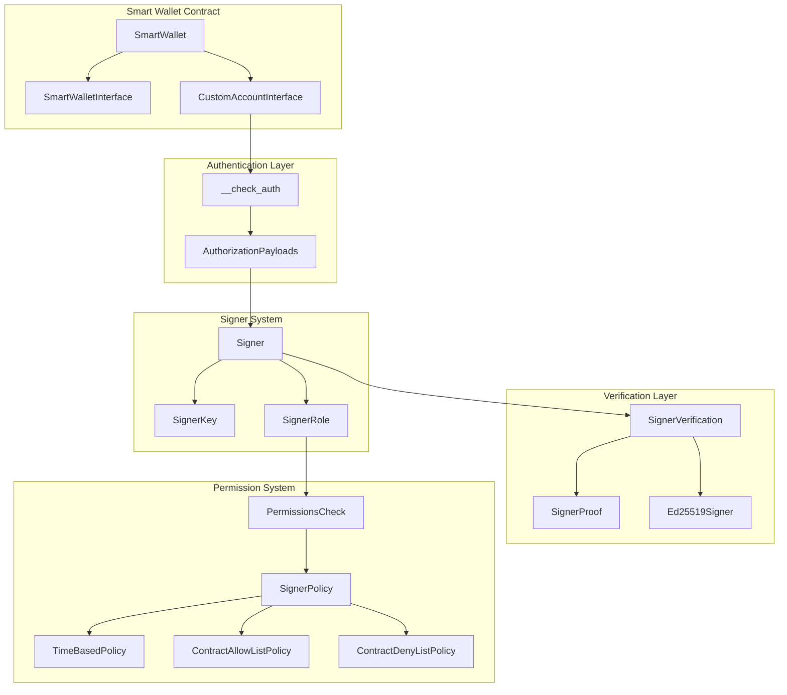
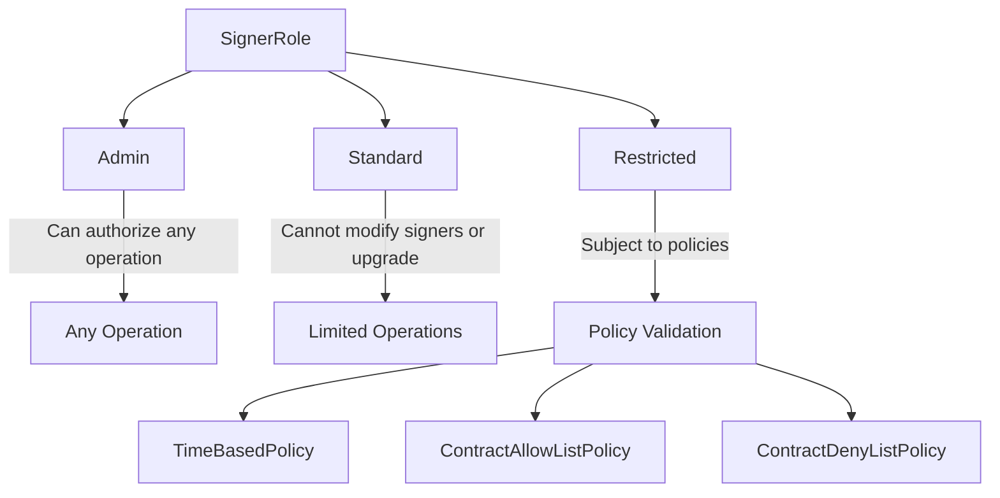
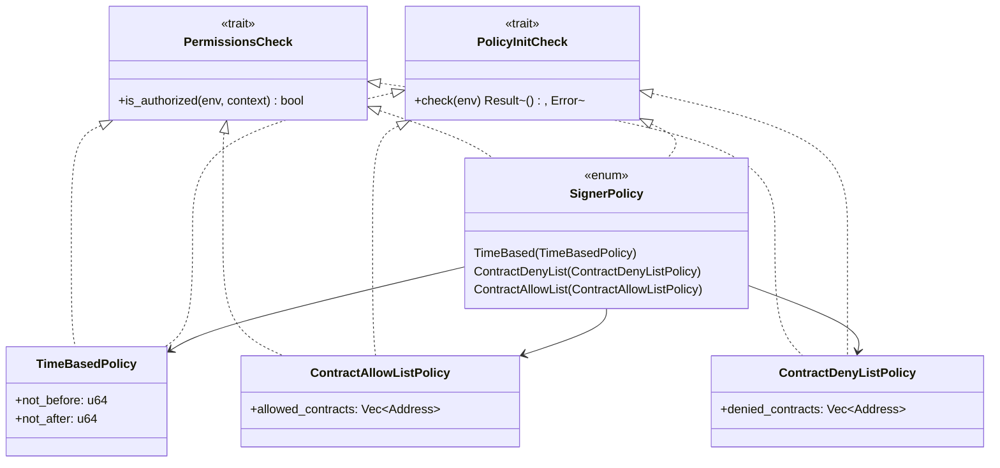
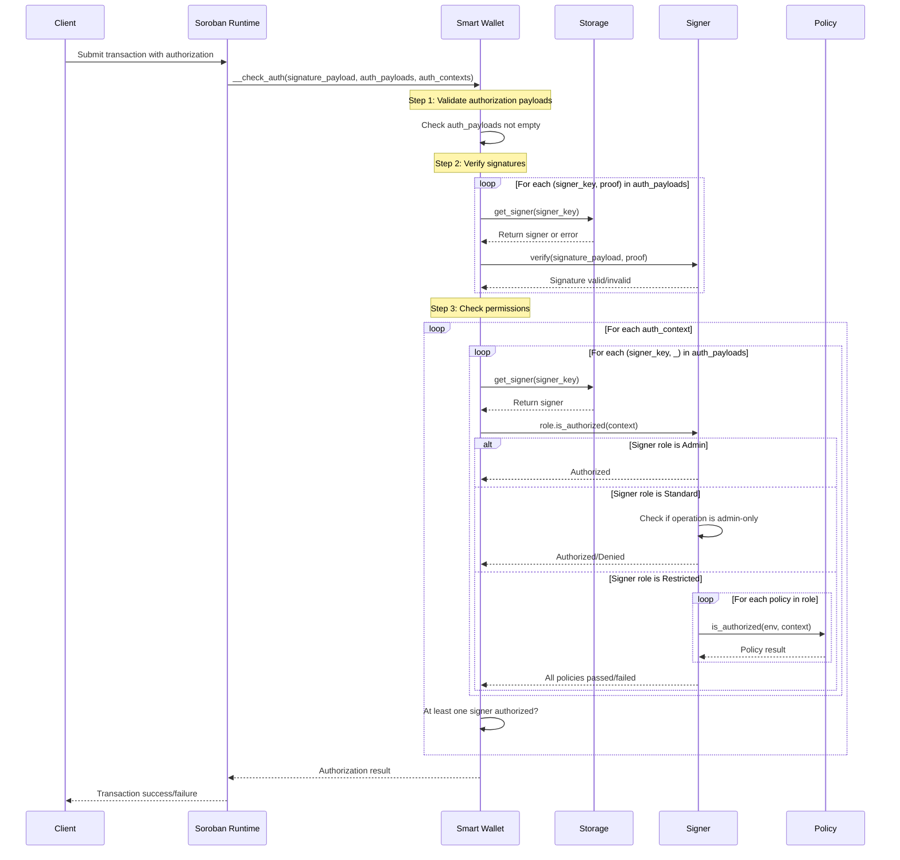

# Smart Wallet Contract Architecture

The Smart Wallet is a multi-signature wallet contract built on Soroban that provides enhanced security through role-based access control and policy-based authorization. It supports multiple cryptographic signature schemes and allows for fine-grained permission management suitable for both human users and AI agents.

## Overview

The Smart Wallet contract implements a flexible authentication system that combines:
- **Multiple signature schemes** (currently Ed25519, extensible to others)
- **Role-based access control** (Admin, Standard, Restricted)
- **Policy-based restrictions** (time-based, contract allow/deny lists)
- **Multi-signature support** with customizable authorization logic

This architecture enables sophisticated permission systems for enterprise blockchain applications, supporting use cases from simple multi-sig wallets to complex automated systems with AI agent integration.

## Core Architecture

### Contract Structure

```
SmartWallet
├── SmartWalletInterface     # Administrative operations
│   ├── __constructor()      # Initialize with signers
│   ├── add_signer()        # Add new signer
│   ├── update_signer()     # Modify existing signer
│   └── revoke_signer()     # Remove signer
└── CustomAccountInterface   # Soroban authentication
    └── __check_auth()      # Validate authorization
```

### Authentication System Architecture



## Signer Types and Extensibility

### Current Signer Implementation

The system currently supports Ed25519 signatures with a design that allows easy extension:

```rust
pub enum SignerKey {
    Ed25519(BytesN<32>),
    // Future signer types can be added here
}

pub enum Signer {
    Ed25519(Ed25519Signer, SignerRole),
    // Future signer implementations can be added here
}

pub enum SignerProof {
    Ed25519(BytesN<64>),
    // Future proof types can be added here
}
```

### Adding New Signer Types

To add a new signer type (e.g., Secp256k1, WebAuthn), follow this pattern:

1. **Define the signer struct** in `src/auth/signers/`:
```rust
#[contracttype]
#[derive(Clone, Debug, PartialEq)]
pub struct NewSigner {
    pub public_key: BytesN<32>, // or appropriate key format
}
```

2. **Implement SignerVerification trait**:
```rust
impl SignerVerification for NewSigner {
    fn verify(&self, env: &Env, payload: &BytesN<32>, proof: &SignerProof) -> Result<(), Error> {
        // Implement signature verification logic
    }
}
```

3. **Add to the enums**:
```rust
// In SignerKey enum
NewSignerType(BytesN<32>),

// In Signer enum  
NewSignerType(NewSigner, SignerRole),

// In SignerProof enum
NewSignerType(BytesN<64>), // or appropriate proof format
```

4. **Update match statements** in the implementation files to handle the new variant.

### Signer Roles



## Policy System and Extensibility

### Current Policy Types

1. **TimeBasedPolicy**: Restricts signer validity to a time window
2. **ContractAllowListPolicy**: Only allows interactions with specified contracts
3. **ContractDenyListPolicy**: Blocks interactions with specified contracts

### Policy Architecture



### Adding New Policy Types

To add a new policy type (e.g., spending limits, rate limiting):

1. **Create the policy struct** in `src/auth/policy/`:
```rust
#[contracttype]
#[derive(Clone, Debug, PartialEq)]
pub struct NewPolicy {
    // Policy-specific fields
}
```

2. **Implement required traits**:
```rust
impl PermissionsCheck for NewPolicy {
    fn is_authorized(&self, env: &Env, context: &Context) -> bool {
        // Authorization logic
    }
}

impl PolicyInitCheck for NewPolicy {
    fn check(&self, env: &Env) -> Result<(), Error> {
        // Validation logic
    }
}
```

3. **Add to SignerPolicy enum**:
```rust
pub enum SignerPolicy {
    // ... existing variants
    NewPolicyType(NewPolicy),
}
```

4. **Update match statements** in the SignerPolicy implementations.

## Authentication Flow and Sequence

### Smart Wallet Validation Sequence



### Sequence Numbers and Nonce Handling

The Smart Wallet relies on Soroban's built-in sequence number mechanism for replay protection:

1. **Soroban Account Sequence**: Each account has an incrementing sequence number
2. **Transaction Ordering**: Transactions must be submitted with correct sequence numbers
3. **Replay Protection**: Used sequence numbers cannot be reused
4. **Multi-sig Coordination**: All signers must agree on the same sequence number

The wallet does not implement custom nonce handling, instead leveraging Soroban's native account sequence system for transaction ordering and replay protection.

## Error Handling

The contract defines comprehensive error types organized by category:

- **Initialization Errors (0-9)**: Contract setup issues
- **Storage Errors (10-19)**: Data persistence problems  
- **Signer Management Errors (20-39)**: Signer lifecycle issues
- **Authentication & Signature Errors (40-59)**: Verification failures
- **Permission Errors (60-79)**: Authorization failures
- **Policy Errors (80-99)**: Policy validation issues
- **Generic Errors (100+)**: General purpose errors

## Usage Examples

### Basic Multi-Signature Setup

```rust
// Initialize wallet with admin and standard signers
let admin_signer = Signer::Ed25519(
    Ed25519Signer::new(admin_pubkey),
    SignerRole::Admin
);

let user_signer = Signer::Ed25519(
    Ed25519Signer::new(user_pubkey), 
    SignerRole::Standard
);

SmartWallet::__constructor(env, vec![admin_signer, user_signer]);
```

### Time-Restricted Signer

```rust
// Create a signer valid only during business hours
let time_policy = TimeBasedPolicy {
    not_before: business_start_timestamp,
    not_after: business_end_timestamp,
};

let restricted_signer = Signer::Ed25519(
    Ed25519Signer::new(temp_pubkey),
    SignerRole::Restricted(vec![SignerPolicy::TimeBased(time_policy)])
);

SmartWallet::add_signer(&env, restricted_signer)?;
```

### Contract-Specific Authorization

```rust
// Signer that can only interact with specific contracts
let allow_policy = ContractAllowListPolicy {
    allowed_contracts: vec![trading_contract_address, vault_contract_address],
};

let trading_signer = Signer::Ed25519(
    Ed25519Signer::new(trading_pubkey),
    SignerRole::Restricted(vec![SignerPolicy::ContractAllowList(allow_policy)])
);
```

## AI Agent Integration

The Smart Wallet architecture is designed to support AI agent integration through:

- **Programmatic Signer Management**: Agents can be granted specific roles and policies
- **Time-Based Access**: Temporary access grants for automated operations
- **Contract-Specific Permissions**: Restrict agents to specific contract interactions
- **Policy Composition**: Combine multiple policies for complex authorization rules

This enables secure automation while maintaining fine-grained control over agent capabilities, making it suitable for both human users and AI-driven applications in the Crossmint ecosystem.

## Security Considerations

1. **Admin Signer Requirement**: At least one admin signer must exist to prevent lockout
2. **Policy Validation**: All policies are validated during signer creation
3. **Signature Verification**: Cryptographic proofs are verified before authorization
4. **Permission Layering**: Multiple authorization checks ensure proper access control
5. **Replay Protection**: Soroban's sequence number system prevents transaction replay

## Future Extensions

The modular architecture supports future enhancements:

- **Additional Signature Schemes**: Secp256k1, WebAuthn, threshold signatures
- **Advanced Policies**: Spending limits, rate limiting, multi-party approval
- **Integration Patterns**: Cross-contract authorization, delegation mechanisms
- **Monitoring**: Event emission for audit trails and analytics
