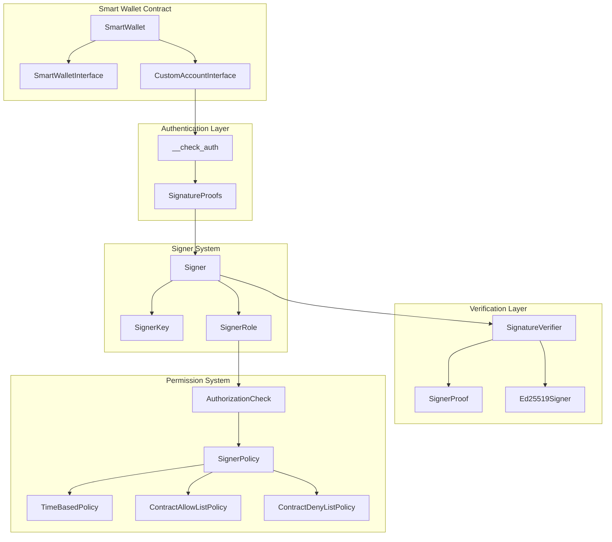
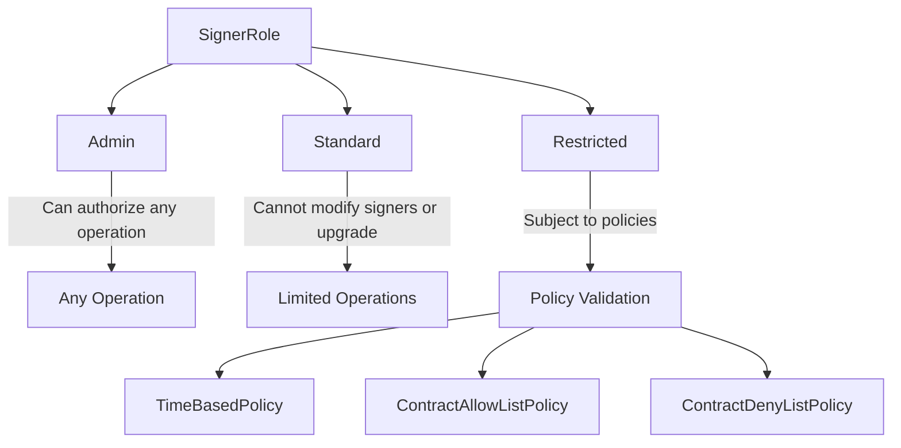
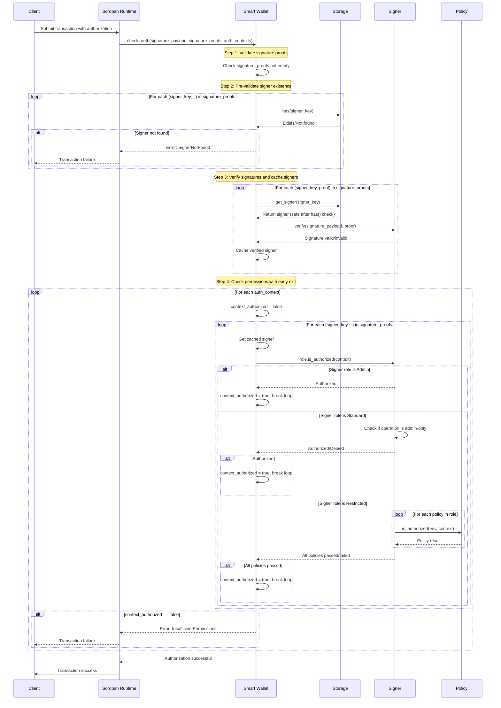
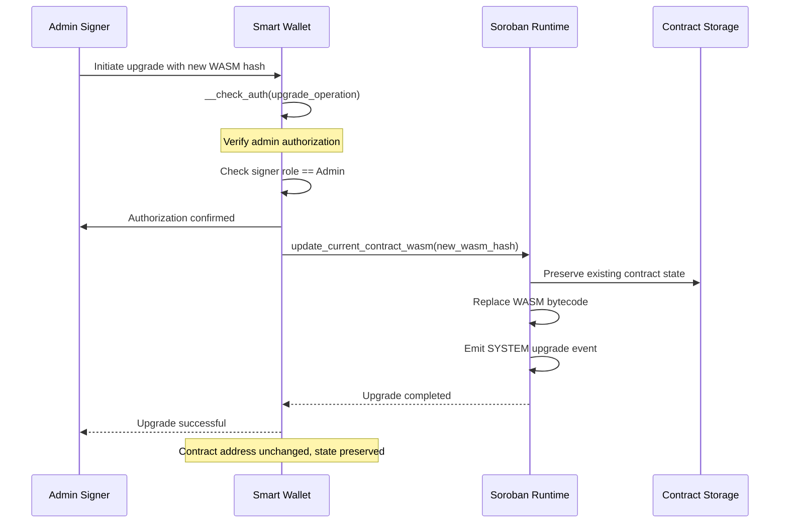

# Smart Wallet Contract Architecture

The Smart Wallet is a multi-signature wallet contract built on Soroban that provides enhanced security through role-based access control and policy-based authorization. It supports multiple cryptographic signature schemes and allows for fine-grained permission management suitable for both human users and AI agents.

## Overview

The Smart Wallet contract implements a flexible authentication system that combines:
- **Multiple signature schemes** (Ed25519 and Secp256r1/WebAuthn, extensible to others)
- **Role-based access control** (Admin, Standard, Restricted)
- **Policy-based restrictions** (time-based, contract allow/deny lists)
- **Multi-signature support** with customizable authorization logic

This architecture enables sophisticated permission systems for enterprise blockchain applications, supporting use cases from simple multi-sig wallets to complex automated systems with AI agent integration.

## Core Architecture

### Contract Structure

```
SmartWallet
├── SmartWalletInterface     # Administrative operations
│   ├── __constructor()      # Initialize with signers
│   ├── add_signer()        # Add new signer
│   ├── update_signer()     # Modify existing signer
│   └── revoke_signer()     # Remove signer
└── CustomAccountInterface   # Soroban authentication
    └── __check_auth()      # Validate authorization
```

### Authentication System Architecture



## Signer Types and Extensibility

### Current Signer Implementation

The system supports Ed25519 and Secp256r1 (WebAuthn/passkey) signatures with a design that allows easy extension:

```rust
pub enum SignerKey {
    Ed25519(BytesN<32>),
    Secp256r1(Bytes),
}

pub enum Signer {
    Ed25519(Ed25519Signer, SignerRole),
    Secp256r1(Secp256r1Signer, SignerRole),
}

pub enum SignerProof {
    Ed25519(BytesN<64>),
    Secp256r1(Secp256r1Signature),
}
```

### Adding New Signer Types

To add a new signer type (e.g., WebAuthn, threshold signatures), follow this pattern:

1. **Define the signer struct** in `src/auth/signers/`:
```rust
#[contracttype]
#[derive(Clone, Debug, PartialEq)]
pub struct NewSigner {
    pub public_key: BytesN<32>, // or appropriate key format
}
```

2. **Implement SignatureVerifier trait**:
```rust
impl SignatureVerifier for NewSigner {
    fn verify(&self, env: &Env, payload: &BytesN<32>, proof: &SignerProof) -> Result<(), Error> {
        // Implement signature verification logic
    }
}
```

3. **Add to the enums**:
```rust
// In SignerKey enum
NewSignerType(BytesN<32>),

// In Signer enum  
NewSignerType(NewSigner, SignerRole),

// In SignerProof enum
NewSignerType(BytesN<64>), // or appropriate proof format
```

4. **Update match statements** in the implementation files to handle the new variant.

### Signer Roles



## Policy System and Extensibility

### Current Policy Types

1. **TimeBasedPolicy**: Restricts signer validity to a time window
2. **ContractAllowListPolicy**: Only allows interactions with specified contracts
3. **ContractDenyListPolicy**: Blocks interactions with specified contracts

### Policy Architecture


### Adding New Policy Types

To add a new policy type (e.g., spending limits, rate limiting):

1. **Create the policy struct** in `src/auth/policy/`:
```rust
#[contracttype]
#[derive(Clone, Debug, PartialEq)]
pub struct NewPolicy {
    // Policy-specific fields
}
```

2. **Implement required traits**:
```rust
impl AuthorizationCheck for NewPolicy {
    fn is_authorized(&self, env: &Env, context: &Context) -> bool {
        // Authorization logic
    }
}

impl PolicyValidator for NewPolicy {
    fn check(&self, env: &Env) -> Result<(), Error> {
        // Validation logic
    }
}
```

3. **Add to SignerPolicy enum**:
```rust
pub enum SignerPolicy {
    // ... existing variants
    NewPolicyType(NewPolicy),
}
```

4. **Update match statements** in the SignerPolicy implementations.

## Authentication Flow and Sequence

### Smart Wallet Validation Sequence



## Gas Cost Analysis for `__check_auth`

### Gas Cost Formula

```
Total_Gas = Storage_Lookups(n) + Signature_Verification + Role_Checks + Policy_Enforcement

Where:
- n = Number of signers
- m = Number of authorization contexts  
- p = Number of policies per signer
- k = Contract list size (for allow/deny policies)
```

### Cost Factors

| Component | Complexity | Notes |
|-----------|------------|-------|
| **Storage Operations** | O(n) | Signer existence checks and retrieval |
| **Ed25519 Signatures** | O(1) | Baseline cost (1x) |
| **Secp256r1 Signatures** | O(1) | ~3x cost vs Ed25519 (includes SHA256 operations) |
| **Admin Role** | O(1) | Constant time authorization |
| **Standard Role** | O(m) | Address comparison per context |
| **Restricted Role** | O(p × m) | Policy evaluation per context |
| **TimeBased Policy** | O(1) | Timestamp comparison |
| **Allow/Deny List Policy** | O(k) | Linear search through contract list |

### Optimization Recommendations

- Use Ed25519 over Secp256r1 for better performance
- Minimize signer count and policy complexity
- Keep contract allow/deny lists small (< 10 contracts)
- Prefer Admin role for high-frequency operations

### Sequence Numbers and Nonce Handling

The Smart Wallet relies on Soroban's built-in sequence number mechanism for replay protection:

1. **Soroban Account Sequence**: Each account has an incrementing sequence number
2. **Transaction Ordering**: Transactions must be submitted with correct sequence numbers
3. **Replay Protection**: Used sequence numbers cannot be reused
4. **Multi-sig Coordination**: All signers must agree on the same sequence number

The wallet does not implement custom nonce handling, instead leveraging Soroban's native account sequence system for transaction ordering and replay protection.

## Contract Upgradeability

The Smart Wallet supports contract upgrades through Soroban's built-in upgradeability mechanism, which allows updating the contract's WebAssembly bytecode without changing the contract address or requiring proxy patterns.

### Upgrade Mechanism

Unlike Ethereum's proxy pattern approach, Soroban contracts can be upgraded directly:

```rust
// Standard Soroban upgrade function (called by authorized admin)
env.deployer().update_current_contract_wasm(new_wasm_hash)
```

Key characteristics of Soroban contract upgrades:
- **Contract address remains unchanged** - No proxy contracts needed
- **State preservation** - Contract storage persists across upgrades
- **Atomic operation** - Upgrade succeeds or fails completely
- **Event emission** - System events track old and new WASM references

### Permission Requirements

Contract upgrades are controlled by the Smart Wallet's role-based permission system:

| Signer Role | Upgrade Permission | Description |
|-------------|-------------------|-------------|
| **Admin** | ✅ **Authorized** | Can authorize any operation including contract upgrades |
| **Standard** | ❌ **Denied** | Cannot modify signers or upgrade contracts |
| **Restricted** | ❌ **Denied** | Subject to policy restrictions, typically cannot upgrade |

The upgrade authorization follows the same `__check_auth` flow as other operations:

```rust
// Admin signer can authorize upgrade operations
if signer.role() == SignerRole::Admin {
    // Authorized for any operation including upgrades
    return Ok(());
}
```

### Upgrade Process Flow



### Security Considerations

1. **Admin-Only Access**: Only Admin signers can perform upgrades, preventing unauthorized modifications
2. **Multi-Signature Support**: Multiple admin signatures can be required for upgrade authorization
3. **State Preservation**: Contract storage remains intact across upgrades
4. **Audit Trail**: Soroban system events provide upgrade history
5. **Rollback Capability**: Previous WASM versions can be redeployed if needed

### Integration with Factory Contract

The `CrossmintContractFactory` handles initial deployment but does not manage upgrades:
- **Initial Deployment**: Factory deploys contracts with role-based access control
- **Upgrade Management**: Individual Smart Wallet contracts handle their own upgrades
- **Permission Inheritance**: Admin roles established during deployment control upgrade access

This separation ensures that each Smart Wallet maintains autonomous control over its upgrade process while benefiting from the factory's standardized deployment patterns.

## Error Handling

The contract defines comprehensive error types organized by category:

- **Initialization Errors (0-9)**: Contract setup issues
- **Storage Errors (10-19)**: Data persistence problems  
- **Signer Management Errors (20-39)**: Signer lifecycle issues
- **Authentication & Signature Errors (40-59)**: Verification failures
- **Permission Errors (60-79)**: Authorization failures
- **Policy Errors (80-99)**: Policy validation issues
- **Generic Errors (100+)**: General purpose errors

## Usage Examples

### Basic Multi-Signature Setup

```rust
// Initialize wallet with admin and standard signers
let admin_signer = Signer::Ed25519(
    Ed25519Signer::new(admin_pubkey),
    SignerRole::Admin
);

let user_signer = Signer::Ed25519(
    Ed25519Signer::new(user_pubkey), 
    SignerRole::Standard
);

SmartWallet::__constructor(env, vec![admin_signer, user_signer]);
```

### Time-Restricted Signer

```rust
// Create a signer valid only during business hours
let time_policy = TimeBasedPolicy {
    not_before: business_start_timestamp,
    not_after: business_end_timestamp,
};

let restricted_signer = Signer::Ed25519(
    Ed25519Signer::new(temp_pubkey),
    SignerRole::Restricted(vec![SignerPolicy::TimeBased(time_policy)])
);

SmartWallet::add_signer(&env, restricted_signer)?;
```

### Contract-Specific Authorization

```rust
// Signer that can only interact with specific contracts
let allow_policy = ContractAllowListPolicy {
    allowed_contracts: vec![trading_contract_address, vault_contract_address],
};

let trading_signer = Signer::Ed25519(
    Ed25519Signer::new(trading_pubkey),
    SignerRole::Restricted(vec![SignerPolicy::ContractAllowList(allow_policy)])
);
```

## AI Agent Integration

The Smart Wallet architecture is designed to support AI agent integration through:

- **Programmatic Signer Management**: Agents can be granted specific roles and policies
- **Time-Based Access**: Temporary access grants for automated operations
- **Contract-Specific Permissions**: Restrict agents to specific contract interactions
- **Policy Composition**: Combine multiple policies for complex authorization rules

This enables secure automation while maintaining fine-grained control over agent capabilities, making it suitable for both human users and AI-driven applications in the Crossmint ecosystem.

## Security Considerations

1. **Admin Signer Requirement**: At least one admin signer must exist to prevent lockout
2. **Policy Validation**: All policies are validated during signer creation
3. **Signature Verification**: Cryptographic proofs are verified before authorization
4. **Permission Layering**: Multiple authorization checks ensure proper access control
5. **Replay Protection**: Soroban's sequence number system prevents transaction replay

## Future Extensions

The modular architecture supports future enhancements:

- **Additional Signature Schemes**: WebAuthn, threshold signatures, multi-party signatures
- **Advanced Policies**: Spending limits, rate limiting, multi-party approval
- **Integration Patterns**: Cross-contract authorization, delegation mechanisms
- **Monitoring**: Event emission for audit trails and analytics
