# Smart Account STRIDE Threat Model

## Description

### What is a Smart Account?

A **Smart Account** is an advanced account implementation built on Stellar's Soroban smart contract platform that provides programmable authorization logic through a custom smart contract. Unlike traditional Stellar accounts that rely solely on Ed25519 signatures and basic multisig thresholds, smart accounts implement Soroban's `CustomAccountInterface` to enable sophisticated, policy-driven authorization rules.

This smart account is an **upgradeable smart contract** that implements both the `SmartAccountInterface` (for account management operations) and Soroban's `CustomAccountInterface` (for transaction authorization). It leverages Stellar's account abstraction framework to decouple authentication logic from application-specific authorization rules, allowing for much more granular control over who can authorize what types of transactions.

The key innovation is moving from Stellar's traditional "signature + threshold" model to a **role-based, policy-driven authorization system** where different signers can have different permission levels and constraints.

### Key Features

#### 🔄 **Fully Authorized Upgradeability**
- Smart contract code can be upgraded through the standard signer permission system
- Upgrades require proper authorization from signers with sufficient permissions
- No special backdoors or admin keys - upgrades follow the same authorization rules as other operations

#### 👥 **Hierarchical Signer Types**

**Admin Signers**
- Can authorize any transaction for the wallet
- Full control over signer configuration (add, update, revoke signers)
- Can authorize contract upgrades
- Cannot be revoked (prevents account lockout)

**Standard Signers**  
- Can authorize most transactions
- Cannot modify signer configuration or upgrade the contract
- Ideal for day-to-day operations while maintaining security boundaries

**Restricted Signers**
- Subject to a modular, policy-based permission system
- Support for granular permissions such as:
  - Token spending limits
  - Contract interaction deny-listing
  - Time-based restrictions
  - Custom authorization policies
- Extensible framework for adding new permission types

#### 🔐 **Multi-Signature Algorithm Support**

**Ed25519 Signatures**
- Traditional cryptographic signatures
- Backward compatible with existing Stellar tooling

**Secp256r1 Signatures** 
- Enables **Passkey/WebAuthn** authentication flows
- Provides better user experience through biometric authentication
- Supports hardware security keys and platform authenticators
- Eliminates the need for users to manage seed phrases

This dual signature support allows the smart account to bridge traditional crypto workflows with modern web authentication standards, making it more accessible to mainstream users while maintaining the security guarantees expected in the Stellar ecosystem.

### Smart Account Authentication Flow

The following sequence diagram illustrates the complete authentication flow when a contract requires authorization from a Smart Account:

```mermaid
sequenceDiagram
    participant User
    participant TokenContract as Token Contract
    participant Runtime as Soroban Runtime
    participant SmartAccount as Smart Account Contract
    participant Storage as Contract Storage
    participant Signer as Signer Implementation
    participant Policy as Policy System
    
    Note over User, Policy: Transaction Initiation
    User->>TokenContract: Submit transaction with authorization
    TokenContract->>TokenContract: Execute business logic
    TokenContract->>Runtime: require_auth(smart_account_address)
    
    Note over Runtime, SmartAccount: Authorization Check (Pre-validation)
    Runtime->>Runtime: Find authorized invocation tree matching require_auth call
    Runtime->>Runtime: Verify signature expiration (reject if expired)
    Runtime->>Runtime: Verify and consume nonce (must be unique)
    Runtime->>Runtime: Build signature payload preimage and compute SHA-256 hash
    Runtime->>SmartAccount: __check_auth(signature_payload, signature_proofs, auth_contexts)
    
    Note over SmartAccount: Step 1: Validate Input
    SmartAccount->>SmartAccount: Check signature_proofs not empty
    alt No signatures provided
        SmartAccount-->>Runtime: Error: NoProofsInAuthEntry
        Runtime-->>TokenContract: Authorization failed
        TokenContract-->>User: Transaction failed
        note right of User: End flow
    end
    
    Note over SmartAccount, Storage: Step 2: Pre-validate Signer Existence
    loop For each (signer_key, _) in signature_proofs
        SmartAccount->>Storage: has(signer_key)
        Storage-->>SmartAccount: Boolean result
        alt Signer not found
            SmartAccount-->>Runtime: Error: SignerNotFound
            Runtime-->>TokenContract: Authorization failed
            TokenContract-->>User: Transaction failed
            note right of User: End flow
        end
    end
    
    Note over SmartAccount, Signer: Step 3: Verify Signatures & Cache Signers
    loop For each (signer_key, proof) in signature_proofs
        SmartAccount->>Storage: get<SignerKey, Signer>(signer_key)
        Storage-->>SmartAccount: Return signer object
        SmartAccount->>Signer: verify(signature_payload, proof)
        
        alt Signature verification
            Signer->>Signer: Cryptographic signature validation
            alt Ed25519 signature
                Signer->>Signer: ed25519_verify(public_key, signature_payload, proof)
            else Secp256r1 signature
                Signer->>Signer: secp256r1_verify(public_key, signature_payload, proof)
            end
            
            alt Signature invalid
                Signer-->>SmartAccount: Error: SignatureVerificationFailed
                SmartAccount-->>Runtime: Error: SignatureVerificationFailed
                Runtime-->>TokenContract: Authorization failed
                TokenContract-->>User: Transaction failed
                note right of User: End flow
            else Signature valid
                Signer-->>SmartAccount: Signature verified
                SmartAccount->>SmartAccount: Cache verified signer
            end
        end
    end
    
    Note over SmartAccount, Policy: Step 4: Authorization Check with Early Exit
    loop For each auth_context in auth_contexts
        SmartAccount->>SmartAccount: context_authorized = false
        
        loop For each verified signer (early exit on success)
            SmartAccount->>SmartAccount: Get cached signer
            SmartAccount->>Signer: role.is_authorized(env, context)
            
            alt Admin Role
                Signer-->>SmartAccount: Always authorized
                SmartAccount->>SmartAccount: context_authorized = true
                SmartAccount->>SmartAccount: Break inner loop (early exit)
                
            else Standard Role
                Signer->>Signer: Check if operation is admin-only
                alt Admin operation (contract = current_contract_address)
                    Signer-->>SmartAccount: Not authorized
                else Non-admin operation
                    Signer-->>SmartAccount: Authorized
                    SmartAccount->>SmartAccount: context_authorized = true
                    SmartAccount->>SmartAccount: Break inner loop (early exit)
                end
                
            else Restricted Role
                Signer->>Signer: Check if admin operation
                alt Admin operation
                    Signer-->>SmartAccount: Not authorized (restricted signers cannot do admin ops)
                else Non-admin operation
                    loop For each policy in signer.role.policies
                        Signer->>Policy: policy.is_authorized(env, context)
                    end
                    
                    alt All policies passed
                        Signer-->>SmartAccount: Authorized
                        SmartAccount->>SmartAccount: context_authorized = true
                        SmartAccount->>SmartAccount: Break inner loop (early exit)
                    else Any policy failed
                        Signer-->>SmartAccount: Not authorized
                    end
                end
            end
        end
        
        alt context_authorized == false
            SmartAccount-->>Runtime: Error: InsufficientPermissions
            Runtime-->>TokenContract: Authorization failed
            TokenContract-->>User: Transaction failed
            note right of User: End flow
        end
    end
    
    Note over SmartAccount, User: Success Flow
    SmartAccount-->>Runtime: Authorization successful
    Runtime-->>TokenContract: Authorization granted
    TokenContract->>TokenContract: Continue business logic execution
    TokenContract-->>User: Transaction successful
```

### Key Security Components

1. **Multi-layered Validation**: The system performs signature existence checks before expensive cryptographic operations
2. **Early Exit Optimization**: Authorization stops as soon as one valid signer is found for each context
3. **Role-based Authorization**: Admin, Standard, and Restricted roles with different permission levels
4. **Policy Enforcement**: Time-based, contract allow/deny list policies for fine-grained control
5. **Cryptographic Verification**: Support for Ed25519 and Secp256r1 signature schemes

## What can go wrong?

### STRIDE Reminders

| Mnemonic Threat | Definition | Question |
|---|---|---|
| Spoofing | The ability to impersonate another user or system component to gain unauthorized access. | Is the user who they say they are? |
| Tampering | Unauthorized alteration of data or code. | Has the data or code been modified in some way? |
| Repudiation | The ability for a system or user to deny having taken a certain action. | Is there enough data to "prove" the user took the action if they were to deny it? |
| Information Disclosure | The over-sharing of data expected to be kept private. | Is there anywhere where excessive data is being shared or controls are not properly in place to protect private information? |
| Denial of Service | The ability for an attacker to negatively affect the availability of a system. | Can someone, without authorization, impact the availability of the service or business? |
| Elevation of Privilege | The ability for an attacker to gain additional privileges and roles beyond what they initially were granted. | Are there ways for a user, without proper authentication (verifying identity) and authorization (verifying permission) to gain access to additional privileges, either through standard (normally legitimate) or illegitimate means? |

### Threat Table

<table>
<tr>
<th>Thread</th>
<th>Issues</th>
</tr>
<tr>
<td>Spoofing</td>
<td>
<!-- Add spoofing issues here -->
</td>
</tr>
<tr>
<td>Tampering</td>
<td>
<!-- Add tampering issues here -->
</td>
</tr>
<tr>
<td>Repudiation</td>
<td>
<!-- Add repudiation issues here -->
</td>
</tr>
<tr>
<td>Information Disclosure</td>
<td>
<!-- Add information disclosure issues here -->
</td>
</tr>
<tr>
<td>Denial of Service</td>
<td>
<!-- Add denial of service issues here -->
</td>
</tr>
<tr>
<td>Elevation of Privilege</td>
<td>
<!-- Add elevation of privilege issues here -->
</td>
</tr>
</table>

## What are we going to do about it?

## Did we do a good job?

### Has the data flow diagram been referenced since it was created?

<!-- Answer here -->

### Did the STRIDE model uncover any new design issues or concerns that had not been previously addressed or thought of?

<!-- Answer here -->

### Did the treatments identified in the "What are we going to do about it" section adequately address the issues identified?

<!-- Answer here -->

### Have additional issues been found after the threat model?

<!-- Answer here -->

### Any additional thoughts or insights on the threat modeling process that could help improve it next time?

<!-- Answer here -->